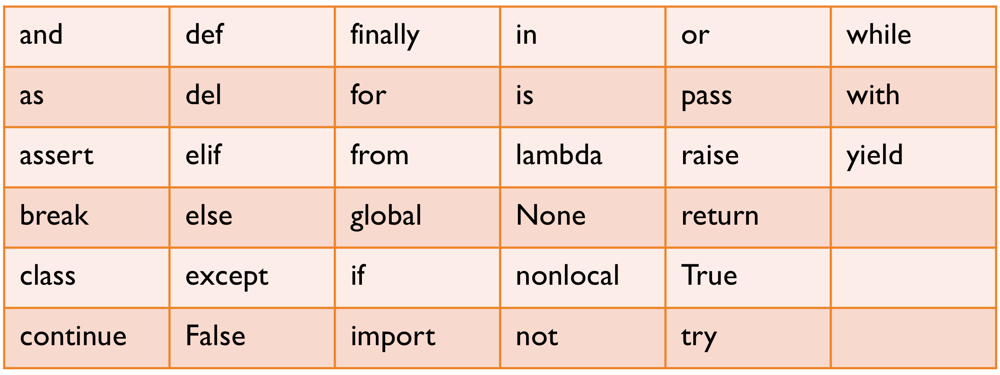
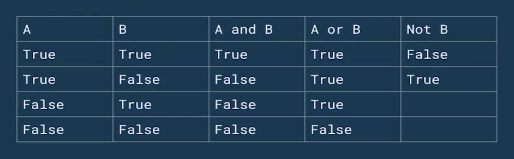

<div align="center">
  <h1>Introducción al Pensamiento Computacional con Python</h1>
</div>

<div align="center"> 
  
</div>

# Introducción al documento

El contenido de este documento esta basado en el curso dictado por [David Aroesti](https://github.com/jdaroesti) en Platzi.

# Tabla de contenido
- [Introducción al pensamiento computacional](#Introducción-al-pensamiento-computacional)
  - [Introducción al cómputo](#Introducción-al-cómputo)
  - [Lenguajes de programación](#Lenguajes-de-programación)
- [Introducción a Python](#Introducción-a-Python)
  - [Elementos básicos de Python](#Elementos-básicos-de-Python)
  - [Objetos, expresiones y tipos numéricos](#Objetos,-expresiones-y-tipos-numéricos)
  - [Asignación de variables](#Asignación-de-variables)
  - [Cadenas](#Cadenas)
  - [Entradas](#Entradas)
  - [Programas ramificados](#Programas-ramificados)
  - [Iteraciones](#Iteraciones)
  - [Bucles for](#Bucles-for)
- [Programas numéricos](#Programas-numéricos)
  - [Representación de flotantes](#Representación-de-flotantes)
  - [Enumeración exhaustiva](#Enumeración-exhaustiva)
  - [Aproximación de soluciones](#Aproximación-de-soluciones)
  - [Búsqueda Binaria](#Búsqueda-Binaria)
- [Funciones, alcance y abstracción](#Funciones,-alcance-y-abstracción)
  - [Funciones y abstracción](#Funciones-y-abstracción)
  - [Scope o Alcance](#Scope-o-Alcance)
  - [Especificaciones del código](#Especificaciones-del-código)
  - [Recursividad](#Recursividad)
  - [Funciones como objetos](#Funciones-como-objetos)
- [Tipos estructurados, mutabilidad y funciones de alto nivel](#Tipos-estructurados,-mutabilidad-y-funciones-de-alto-nivel)
  - [Tuplas](#Tuplas)
  - [Rangos](#Rangos)
  - [Listas y mutabilidad](#Listas-y-mutabilidad)
  - [Diccionarios](#Diccionarios)
- [Pruebas y debbugging](#Pruebas-y-debbugging)
  - [Pruebas de caja negra](#Pruebas-de-caja-negra)
  - [Pruebas de caja de cristal](#Pruebas-de-caja-de-cristal)
  - [Debugging](#Debugging)
- [Excepciones y afirmaciones](#Excepciones-y-afirmaciones)
  - [Manejo de excepciones](#Manejo-de-excepciones)
  - [Excepciones como control de flujo](#Excepciones-como-control-de-flujo)
  - [Afirmaciones](#Afirmaciones)

# Introducción al pensamiento computacional
## Introducción al cómputo

Posiblemente la primera computadora fue creada por los **antiguos griegos** el cual tenia el propósito de calcular las posiciones del Sol, Luna y algunos otros cuerpos celestes.

Seguidas a esta surgieron otras que ayudaron a progressivos avances que tederminarian la computación como lo es hoy en dia. Entre ella tenemos:

**telar de Jacquard**

**motor analítico de Charles Babbage**

**máquina tabuladora**

Antiguamente existía la **profesión de computadora**, la cual eran personas que se dedicaban a seguir ciertas instruccion para realizar calculos y obtener x resultados, sin embargo, debido a los errores frecuentes en los mismos. Posterior a ello, llegan **Alan Turing** y **Alonzo Church** con la idea de que todos los algoritmos desarrollados por la humanidad podían ser reducidas a una maquina imaginaria, que tuviera una cinta infinita donde apuntarían símbolos y estos símbolos se pudieran manipular. Es aquí donde se comenzó la carrera para crear la primera computadora electrónica, el cual fue el **ENIAC**.

**John von Neumann** se dio cuenta de que en el hardware no solo se podía almacenar el poder de computo, también los programas para ejecutar. A esta arquitectura se le llama la **arquitectura de von Neumman.** De esta arquitectura nace la máquina **EDVAC** (Electronic Discrete Automatic Computer).

Con la llegada de los **microchips** llego la pauta para la computación de hoy en día. Estos microchips se hicieron tan pequeños con el tiempo usando la tecnología de la **fotónica.**

Ya en nuestros tiempos llego la **nube**, el cual son data centers que no son mas que miles o millones de computadoras.


**Richar Feyman** deja las bases del computo cuántico.


## Lenguajes de programación

¿Cómo le damos instrucciones a las computadoras? Primero debemos saber que existen **conocimiento declarativo e imperativo.** El conocimiento **declarativo** define las relaciones que existen entre diversas variables, por ejemplo una fórmula matemática. En el caso del **imperativo** nos dice como llegar a un resultado, y dentro de este existen los **algoritmos.**

Un **algoritmo** es una _lista finita de instrucciones_ que describen un cómputo, que cuando se ejecuta con ciertas entradas _(inputs)_ ejecuta pasos intermedios para llegar a un resultado _(output)_. Los algoritmos se conocen desde los antiguos griegos, y fue la evolución de estos que nos dieron los primeros **lenguajes de programación.**

**Ada Lovelace** se dio cuenta de que con las bases teóricas del _motor analítico_ podía calcular una serie de los _números de Bernoulli_, y así creo el primer programa de computación.

**Grace Murray Hopper** fue pionera en el mundo de las ciencias de la computación, desarrolló el primer compilador para un lenguaje de programación así como también propició métodos de validación. Grace se le ocurrió la idea de tomar unas instrucciones de 1 y 0 para simplificarlos en una instrucción mas entendible para las personas, idea que fue el punta pie inicial para los **lenguajes de programación modernos.**

**Dennis Ritchie**, Inventa el lenguaje _C_, uno de los lenguajes mas importantes de la historia.

**Guido van Rossum**, Crea uno de los lenguajes de programación para su epoca mas orientado al lenguaje humano.

Los lenguajes **Turing completeness**, ya que implementan todos los principios para implementar cualquier tipo de _algoritmo._

Todos los **lenguajes** tienen:
- **Sintaxis:** Define la secuencia de símbolos que está bien formada.
- **Semántica estática:** Define que enunciados con sintaxis correcta tienen significado.
- **Semántica:** Define el significado. En los lenguajes de programación solo hay un significado.

En los lenguajes tenemos definiciones como:

- Bajo nivel vs alto nivel: 
  **Bajo nivel** significa que esta diseñado para las **máquinas**. **Alto nivel** por su parte es orientado a los **humanos.**

- General vs dominio específico: Los lenguajes **generales** tienen todos los primitivos de Turing para poder implementar y computar cualquier tipo de algoritmo. Por otro lado los de **dominio específico** son lenguajes especializados a tareas muy específicas.

- Interpretado vs compilado: En los lenguajes **interpretados** mientras corre el programa se traduce la instrucción a lenguaje máquina que para ejecutar, en cambio para los lenguajes **compilados** estos toman todas las instrucciones y las traduce _antes_ a lenguaje máquina.

# Introducción a Python

## Elementos básicos de Python

Los elementos básicos son:

- **Literales:** son formas simples de inicializar objetos directamente en memoria.
  ```
  literales = 1, 'abc', 2.0, True
  ```

- **Operadores:** son los operadores algebraicos.
  ```
  operadores - + * / % ** =
  ```

## Objetos, expresiones y tipos numéricos

Vamos hablar de **objetos, expresiones y tipos numéricos.**

- **Objetos**: son la abstracción más alta de cualquier lenguaje de programación, son la forma en que modelamos el mundo dentro de nuestros programas. Los objetos se encuentran en memoria y podemos referenciarlas con algún tipo de variable.

- **Tipos**: los _objetos_ pueden ser enteros, flotantes, booleanos e incluso pueden ser objetos más complejos como el modelo de un humano con todos sus características y atributos. 

- **Escalares vs no escalares**: los **escalares** son datos que podemos subdividir en piezas fundamentales, estos pueden ser enteros, flotantes, etc. Los **no escalares** son los datos que no podemos _subdividir_.

## Asignación de variables

Las **variables** son simplemente _nombres_ que se vinculan con un _valor en memoria_, y la forma en la que los _vinculamos_ es a través del =**, y para _comparar_ su valor utilizamos ==.** La forma correcta de nombrar nuestras variables es darles un nombre _descriptivo_.

Cuando el espacio en memoria ya no tiene ninguna variable que la referencie, el **garabage collector** libera este espacio.

Cada uno de los lenguajes de programación tiene sus reglas. Algunas reglas para las variables en Python son:

- Pueden contener mayúsculas, minúsculas, números(sin comenzar con uno) y el símbolo _
- No pueden llamarse como las **palabras reservadas**.

Los lenguajes tienen algo llamado **palabras reservadas**, estas son objetos dentro del lenguaje que ya tienen alguna función o valor asignado.

<br>
<div align="center"> 
  
</div>
<br>

## Cadenas

Las **cadenas** son secuencias de caracteres.

```py
'123'         #Esta es una cadena
```

Los _operadores_ que utilizamos tienen otros significados. Cuando utilizamos el operador **multiplicar (*)** lo que haremos es multiplicar la cadena por el numero de veces que deseamos, y con el operador **suma (+)** concatenaremos varias cadenas, sin embargo _Python_ nos permite concatenar de una forma mas legible.

```py
'123' * 3               # Con el operador *
'123123123'             # Obtenemos este resultado.

'123' + '456'           # Y el operador +
'123456'                # Concatenara las cadenas.

('Hip ' * 3) + 'hurra'  # También podemos combinar operadores
'Hip Hip Hip hurra'

f'{"Hip " * 3}hurra'    # En Python podemos usar la expresión f para concatenar
'Hip Hip Hip hurra'
```

A las cadenas les podemos asignar diversas funciones:

- len: nos indica la longitud de la cadena.
- indexing: con esto podemos acceder a cada uno de los elementos de esta cadena a través de indices.
- slicing: podemos dividir las cadenas subcadenas.

```py
my_str = 'Hello, world!'    # Creamos una cadena

len(my_str)                 # Consultamos por su longitud
13

my_str[0]                   # Con slicing consultamos por el 1er caracter.
'H'

my_str[1]                   # Consultamos por el 2do caracter.
'e'

my_str[2]                   # Consultamos por el 3er caracter.
'l'

my_str[2:]                  # Traemos desde el 3er caracter hasta el final.
'llo, world!'

# Es importante indicar que los finales no son inclusivos.

my_str[:3]                  # Tremos desde el principio hasta el 3ro.
'Hel'

my_str[2:5]                 # Traemos desde el 3er caracter hasta el 5to.
'llo'

my_str[::2]                 # Traemos desde el principio hasta el final saltando de 2 en 2.
'Hlo ol!'
```

- Los objetos de tipo str pueden representarse con _comillas dobles (")_ o _comillas simples (')_
- El operador _suma (+)_ tiene diferente significado según el tipo de dato. Con **cadenas** significa _concatenación_.
- El operador _multiplicación (*)_ es el operador de _repetición_ con **cadenas**.
- Las cadenas son **inmutables**. Esto significa que una vez que creamos una cadena en memoria esta ya no puede cambiar, podemos reasignar la variable que la referencia a otro valor, pero la cadena en memoria no cambiara.

## Entradas

Las **entradas** son una forma recibir información para que las computadoras logren realizas cómputos.


```bash
nombre = input('Cual es tu nombre: ')   # Utilizamos input para ingresar un nombre
Cual es tu nombre: Karl

print(nombre) # Vemos que contiene nuestra variable nombre
Karl

print(f'Tu nombre es {nombre}')   # Imprimimos una cadena concatenando una oración con nuestra variable.
Tu nombre es Karl

numero = input('Escribe un numero: ')   # Utilizamos input para ingresar un numero
Escribe un numero: 45

numero    # Vemos que contiene nuestra variable numero
'45'

type(numero)    # Vemos el tipo de dato que es numero
<class 'str'>   # Y vemos que es un str

numero = int(input('Escribe un numero: '))  # Pero si definimos previamente el input como int
Escribe un numero: 45

type(numero)    # Nuestra variable numero sera de tipo int
<class 'int'>
```

## Programas ramificados

Para que nuestros programas realicen trabajos interesantes estos deben ser capaces de tomar decisiones, test o pruebas, es desde este concepto donde salen las **ramificaciones.** Dentro de los test que podemos realizar son los operadores de **comparación** y estos nos devolverás si la comparación es **verdadera (True)** o **falsa (False).**

- **Igual (==)**: Lo utilizaremos para comparar 2 objetos.
- **Distinto (!=)**: Verificamos que los objetos sean distintos.
- **Mayor que (>)**: Igual que en álgebra, comparamos si el primer termino es mayor que el segundo.
- **Menor que (<)**: Verificamos que el primer termino sea menor que el segundo.
- **Mayor igual que (>=)**: Verificamos que el primer termino sea mayor igual al segundo.
- **Menor igual que (<=)**: Verificamos que el primer termino sea menor igual al segundo.

Además de los operadores de comparación también tenemos los operadores lógicos, estos son 3 **(and, or, not).**

<br>
<div align="center"> 
  
</div>
<br>

Una vez que podemos entender bien los operadores de comparación y lógicos podemos generar nuestros **programas ramificados.** Una forma típica de ocupar los operadores es con el método **if.**

```py
if condition:   # Evaluamos en primera instancia una condición.
    expresion
elif:           # En caso de que no se cumpla la condición anterior evaluamos nuevamente con otra.
    expresion
else:           # En caso de que no se cumpla ninguna condición.
    expresion

## Iteraciones

Las **iteraciones** nos permiten repetir las operaciones de una manera simple.

- La mayoría de las tareas computacionales no se pueden lograr con ramificaciones.
- Cuando queremos que un programa haga lo mismo varias veces, utilizaremos iteraciones.
- Se pueden escribir iteraciones dentro de iteraciones.
- Podemos utilizar _break_ para salir de una iteración.
- Tener cuidado de iteraciones infinitas.

## Bucles for

Los bucles, en diversos lenguajes de programación pueden ser definidos o indefinidos. Los bucles definidos preestablecen las condiciones de la iteración por adelantado. Por su parte, los bucles indefinidos establecen la condición en la que una iteración terminará. En este último tipo de bucles existe el riesgo de que el bucle se vuelva infinito (cuando la condición de suspensión nunca se cumple).

Los bucles definidos se implementan en Python a través del keyword **for**. Por su parte, los bucles indefinidos se implementan con el keyword **while**.

### Iterables

En Python, un iterable es un objeto que se puede utilizar en un bucle definido. Si un objeto es iterable significa que se puede pasar como argumento a la función **iter**. El **iterable** que se pasa como parámetro a la función **iter** regresa un **iterator**.

```py
>>> iter('cadena')                  # cadena
>>> iter(['a', 'b', 'c'])           # lista
>>> iter(('a', 'b', 'c'))           # tupla
>>> iter({'a', 'b', 'c'})           # conjunto
>>> iter({'a': 1, 'b': 2, 'c': 3})  # diccionario
```

Todas las llamadas anteriores regresan un objeto de tipo **iterator**.

¿Qué pasa si le pasamos a la función **iter** un objeto que no en **iterable**? Obtendremos un **TypeError** que señala que el objeto no es un **iterable**. Esto es un ejemplo de programación defensiva en el que Python verifica el tipo del objeto antes de proceder al cómputo. ¡Intentalo en tu consola!

Es importante señalar que estos no son los únicos tipos de objetos que pueden ser **iterable**. Existen gran cantidad de ejemplos en la librería estándar y, de hecho, casi cualquier objeto se puede convertir en un **iterable** (pero eso ya lo veremos cuando hablemos de Python avanzado).

### Iterators

Ahora que ya sabemos cómo obtener un **iterator**, ¿Qué podemos hacer con él? Un **iterator** es un objeto que regresa sucesivamente los valores asociados con el iterable.

```py
>>> frutas = ['manzana', 'pera', 'mango']
>>> iterador = iter(frutas)
>>> next(iterador)
manzana
>>> next(iterador)
pera
>>> next(iterador)
mango
```

Como puedes ver, el **iterator** guarda el estado interno de la iteración, de tal manera que cada llamada sucesiva a **next** regresa el siguiente elemento. ¿Qué pasa una vez que ya no existan más elementos en el **iterable**? La llamada a **next** arrojará un error de tipo **StopIteration**.

### ¿Cómo implementa Python los bucles definidos?

Ahora ya conocemos todos los elementos necesarios para entender que es lo que sucede en Python cuando ejecutamos un bucle **for**. Considera nuevamente el siguiente código:

```py
>>> frutas = ['manzana', 'pera', 'mango']
>>> for fruta in frutas:
        print(fruta)
```

Este bucle se puede describir con los conceptos que explicamos previamente:

1. Python llama internamente la función **iter** para obtener un **iterator**
2. Una vez que tiene un **iterator** llama repetidamente la función next para tener acceso al siguiente elemento en el bucle.
3. Detiene el bucle una vez que se arroja el error **StopIteration**.

### Bucles for con diccionarios

Para iterar a lo largo de un diccionario tenemos varias opciones:

- Ejecutar el bucle **for** directamente en el diccionario, lo cual nos permite iterar a lo largo de las llaves del diccionario.
- Ejecutar el bucle **for** en la llamada **keys** del diccionario, lo cual nos permite iterar a lo largo de las llaves del diccionario.
- Ejecutar el bucle **for** en la llamada **values** del diccionario, lo cual nos permite iterar a lo largo de los valores del diccionario.
- Ejecutar el bucle **for** en la llamada **items** del diccionario, lo cual nos permite iterar en una tupla de las llaves y los valores del diccionario.

```py
estudiantes = {
    'mexico': 10,
    'colombia': 15,
    'puerto_rico': 4,
}

for pais in estudiantes:
    ...

for pais in estudiantes.keys():
    ...

for numero_de_estudiantes in estudiantes.values():
    ...

for pais, numero_de_estudiantes in estudiantes.items():
    ...
```

### Modificación del comportamiento de un bucle for

Podemos modificar el comportamiento de un bucle **for** mediante los _keywords_ **break** y **continue**.

**break** termina el bucle y permite continuar con el resto del flujo de nuestro programa.

**continue** termina la iteración en curso y continua con el siguiente ciclo de iteración.


# Programas numéricos

## Representación de flotantes

La mayoría del tiempo los números flotantes (tipo **float**) son una muy buena aproximación de los números que queremos calcular con nuestras computadoras. Sin embargo, “la mayoría del tiempo” no significan todo el tiempo lo mismo, y cuando no se comportan de esta manera puede tener consecuencias inesperadas. Y para eso necesitamos entender números binarios.

## Enumeración exhaustiva

También llamado "adivina y verifica" donde simplemente generamos todas las posibilidades. Técnicamente este no es un algoritmo eficiente, sin embargo, dependiendo del universo de posibilidades puede ser que sea el mas adecuado, ya que _las computadoras actuales son muy rápidas_ y por lo tanto la eficiencia de nuestro programa no es relevante, por lo tanto siempre ten en mente este tipo de **algoritmo** como uno de los **primeros en implementar**.

## Aproximación de soluciones

Es similar a la enumeración exhaustiva, pero no necesita una respuesta exacta, por lo tanto podemos aproximar soluciones con un margen de error que llamaremos **epsilon**.

Como siempre en programación debemos hacer un _trade-off_, no podemos ser precisos y rápidos a la vez, por lo tanto cuando nuestro **epsilon** es muy pequeño esto significa que debemos realizar **mas iteraciones** para llegar a la aproximación, lo cual significa sacrificar tiempo. Y por otro lado si queremos que nuestro **tiempo de ejecución** sea lo **mas corto posible** debemos sacrificar la **precisión** aumentando el valor de **epsilon**.

## Búsqueda Binaria

Cuando la respuesta se encuentra en un conjunto ordenado, podemos utilizar **búsqueda binaria**. Es altamente eficiente, pues corta el espacio de búsqueda en dos por cada iteración. 

# Funciones, alcance y abstracción

## Funciones y abstracción

La **abstracción** significa que no necesitas entender como funciona algo para utilizarlo. Un ejemplo de esto es una _calculadora_, en este caso no muchos saben como funciona el circuito interno de una calculadora, sin embargo esto no nos limita a utilizarlo, ya que solo necesitamos saber como operarlo.

Una de las habilidades mas importantes en la programación es la **abstracción**, ya que utilizaremos la mayoría del tiempo códigos y librerías de otras personas, por lo que solamente debemos saber operarlos.

La **decomposición** nos permite dividir el código en **componentes (funciones)** que colaboran con un fin en común. Esto se puede pensar como mini programas dentro de un programa mayor.

Para poder escribir una **función** en _Python_ lo hacemos con **def**

```py
"""Las funciones se definen con 'def' luego del nombre y los parámetros que necesitara."""
def nombre(parámetros):

    """Ejecutamos las expresiones que necesitemos"""
    cuerpo

    """Y retornaremos el valor que queramos. El return no es obligatorio."""
    return expresion

"""Aquí definimos una función suma"""
def suma(a, b):
    total = a + b
    return total

"""Y para ejecutarlo simplemente llamamos a la
función por su nombre e ingresamos los parámetros que necesita"""
suma(2, 3)
```

## Scope o Alcance

Cuando ejecutamos una función esto significa que el lenguaje de programación entrara en un nuevo contexto de ejecución, y en este contexto se le asigna ciertas variables de los cuales tenemos acceso a través del código. Sin importar que declaremos una variable, si no hacemos uso de este no tendremos acceso a él.

El uso de las variables y acceso a él a lo largo de nuestro código se llama **scope.**

## Especificaciones del código

La especificación del código es un **comentario** en el que informamos de forma **explicita** y **concisa** lo que realizan nuestras instrucciones. Tenemos que tener 3 items importantes en la documentación:

- Que hace la instrucción.
- Que significan los parámetros.
- Que es lo que devuelve nuestra instrucción.

## Recursividad

La recursividad se puede definir de 2 formas:

- **Algorítmica:** Una forma de crear soluciones utilizando el principio de "divide y vencerás". Esto significa que podemos resolver un problema dividiéndolo en pequeñas versiones mas simple e ir resolviéndolos de a poco.

- **Programática:** Una técnica programática mediante la cual una función se llama a sí misma.

## Funciones como objetos

Una de las características más poderosas de Python es que todo es un objeto, incluyendo las funciones. Las funciones en Python son “ciudadanos de primera clase”.

Esto, en sentido amplio, significa que en Python las funciones:

- Tienen un tipo
- Se pueden pasar como argumentos de otras funciones
- Se pueden utilizar en expresiones
- Se pueden incluir en varias estructuras de datos (como listas, tuplas, diccionarios, etc.)

### Argumentos de otras funciones

Hasta ahora hemos visto que las funciones pueden recibir parámetros para realizar los cómputos que definen. Algunos de los tipos que hemos pasado son tipos simples como cadenas, números, listas, etc. Sin embargo, también pueden recibir funciones para crear abstracciones más poderosas. Veamos un ejemplo:

```py
def multiplicar_por_dos(n):
    return n * 2

def sumar_dos(n):
    return n + 2

def aplicar_operacion(f, numeros):
    resultados = []
    for numero in numeros:
        resultado = f(numero)
        resultados.append(resultado)

>>> nums = [1, 2, 3]
>>> aplicar_operacion(multiplicar_por_dos, nums)
[2, 4, 6]

>>> aplicar_operacion(sumar_dos, nums)
[3, 4, 5]
```

### Funciones en expresiones

Una forma de definir una función en una expresión es utilizando el keyword lambda. lambda tiene la siguiente sintaxis: lambda <vars>: <expresion>.

Otro ejemplo interesante es que las funciones se pueden utilizar en una expresión directamente. Esto es posible porque como lo hemos platicado con anterioridad, en Python las variables son simplemente nombres que apuntan a un objeto (en este caso a una función). Por ejemplo:

```py
sumar = lambda x, y: x + y

>>> sumar(2, 3)
5
```

### Funciones en estructuras de datos

Las funciones también se pueden incluir en diversas estructuras que las permiten almacenar. Por ejemplo, una lista puede guardar diversas funciones a aplicar o un diccionario las puede almacenar como valores.

```py
def aplicar_operaciones(num):
    operaciones = [abs, float]

    resultado = []
    for operacion in operaciones:
        resultado.append(operacion(num))

    return resultado

>>> aplicar_operaciones(-2)
[2, -2.0]
```


# Tipos estructurados, mutabilidad y funciones de alto nivel

## Tuplas

Las **tuplas** son secuencias inmutables _(no se pueden modificar)_ de objetos, que a diferencia de las _cadenas_ pueden contener cualquier tipo de _objetos_. Estas pueden utilizarse para devolver varios valores en una función.

## Rangos

Los **rangos** representan una secuencia de _enteros_ y se escriben como **range(comienzo, fin, pasos)** _comienzo y pasos son argumentos opcionales_. Al igual que las cadenas y las tuplas, los rangos son _inmutables_. Los **rangos** son muy eficientes en uso de memoria y normalmente utilizados en _for loops_.

## Listas y mutabilidad

Las **listas** son secuencias de objetos, pero a diferencia de las [tuplas](#Tuplas) y [rangos](#Rangos), **sí son mutables**. Es posible _iterar_ con ellas, y cuando _modificas_ una lista, pueden existir efectos secundarios _(side effects)_.

Para modificar una lista podemos:
- Asignar vía índice (_my_lista[0] = 5_)
- Utilizar los métodos de la lista (_append, pop, remove, insert, etc._)

```py
"""Vamos a generar nuestra primera lista"""
my_list = [1, 2, 3]

"""Para acceder al primer índice lo haremos de la siguiente forma"""
my_list[0]
1

########################################################

"""Si queremos utilizar la notación de slices (dividir) definimos los
índices en los que dividiremos nuestra lista."""

"""Aquí llamaremos desde el 2do índice hasta el final."""
my_list[1:]
[2, 3]

########################################################

"""Para agregar un ítem a nuestra lista lo haremos con la función append"""
my_list.append(4)

"""Ahora la lista tendrá 4 objetos."""
print(my_list)
[1, 2, 3, 4]

########################################################

"""Para modificar un elemento podemos hacerlo
referenciando su índice"""
my_list[0] = 'a'
print(my_list)
['a', 2, 3, 5]

########################################################

"""El método pop eliminara el último elemento de nuestra lista"""
my_list.pop()
4

print(my_list)
['a', 2, 3]

########################################################

"""Cuando una variable hace referencia a una lista
significa que apunta al mismo espacio en memoria,
esto significa que si cambia la lista se vera reflejado
en todas sus referencias, esto es un side effect"""

"""Creamos la lista a"""
a = [1, 2, 3]

"""Creamos la lista b que hará referencia a la lista a"""
b = a

"""Si imprimimos las listas serán iguales"""
a
[1, 2, 3]

b
[1, 2, 3]

"""Si agrego un objeto a la lista a también se
vera reflejado en b"""
a.append(4)

a
[1, 2, 3, 4]

b
[1, 2, 3, 4]

"""Por esto debes tener mucho ojo al modificar las listas."""
```

### Clonación

Casi siempre es mejor **clonar** una _lista_ en vez de mutarla, esto nos ayuda a disminuir el riesgo de pérdida de la información. Para **clonar** una _lista_ podemos utilizar rebanadas (slices) o la función **list.**

```py
"""Crearemos una lista a"""
a = [1, 2, 3]

"""Con la variable b clonaremos la lista a"""
b = list(a)

"""Si removemos el último elemento de a
no se vera reflejado en b"""
a.pop()
3

"""Veamos los elementos de a"""
a
[1,2]

"""Y los elementos de b"""
b
[1, 2, 3]
```

### List comprehension

Es una forma concisa de aplicar operaciones a los valores de una secuencia. También se pueden aplicar condiciones para filtrar.

```py
"""Vamos a crear una lista con una operacion de range"""
my_list = list(range(10))


"""Si revisamos que contiene veremos que tiene todos
los números desde el 0 al 9"""
my_list
[0, 1, 2, 3, 4, 5, 6, 7, 8, 9]

###########################################################

"""Ahora aplicaremos un list comprehension en donde
vamos a multiplicar * 2 cada uno de los elementos"""
double = [i * 2 for i in my_list]


"""Y si revisamos los elementos de la lista veremos"""
double
[0, 2, 4, 6, 8, 10, 12, 14, 16, 18]

###########################################################

"""Otro ejemplo de list comprehension puede ser
solo tomar los numeros pares de nuestra lista"""
pares = [i for i in my_list if i % 2 == 0]


"""Y si revisamos los elementos de la lista veremos"""
pares
[0, 2, 4, 6, 8]
```

## Diccionarios

Los **diccionarios** son como listas, pero en lugar de usar índices utilizan **llaves**. Estos **no tienen un orden interno**, son **mutables** y pueden **iterarse.**

```py
"""Creamos un diccionario utilizando los símbolos {} y debemos
darle un nombre a cada llave"""
my_dict = {
    'nombre': 'Karl',
    'apellido': 'Behrens',
    'edad': 26
}


"""Para acceder algún dato de nuestro diccionario simplemente
llamamos nuestro diccionario y la llave"""
my_dict['apellido']
'Behrens'

###########################################################

"""Si queremos acceder a una llave pero la llave no existe, 
podemos definir que nos devuelva una respuesta predeterminada"""
my_dict.get('email', 30)
30


"""Si llamamos una llave válida tendremos su valor"""
my_dict.get('nombre', 30)
'Karl'

###########################################################

"""Para reasignar un valor simplemente lo hacemos
referenciando su llave"""

my_dict
{'nombre': 'Karl', 'apellido': 'Behrens', 'edad': 26}

my_dict['edad'] = 30

"""Vemos que la el valor de edad cambio"""

my_dict
{'nombre': 'Karl', 'apellido': 'Behrens', 'edad': 30}

###########################################################

"""Si queremos eliminar un elemento lo
haremos con el método del y referenciado su llave"""

del my_dict['edad']

my_dict
{'nombre': 'Karl', 'apellido': 'Behrens'}

###########################################################

"""Para obtener las llaves de nuestro diccionario
realizamos un método for loop."""

for llave in my_dict.keys():
    print(llave)

nombre
apellido


"""Y para los valores es muy parecido"""

for valor in my_dict.values():
    print(valor)

Karl
Behrens


"""También podemos combinar estos for loops"""

for llave, valor in my_dict.items():
    print(llave, valor)

nombre Karl
apellido Behrens

###########################################################

"""Si deseamos revisar si una llave existe en nuestro diccionario
lo hacemos con un in"""

'email' in my_dict
False


'apellido' in my_dict
True
```

# Pruebas y debbugging

## Pruebas de caja negra

Las **pruebas de caja negra** se basan en la especificación de la función o el programa, aquí debemos probas sus **inputs** y validar los **outputs.** Se llama **caja negra** por que no necesitamos saber necesariamente los procesos internos del programa, solo contrastar sus resultados. 

Estos tipos de pruebas son muy importantes para 2 tipos de test: 

- **Unit testing:** se realizan pruebas a cada uno de los módulos para determinar su correcto funcionamiento.

- **Integration testing:** es cuando vemos que todos los módulos funcionan entre sí.

Es una **buena práctica** realizar los test **antes** de crear tus lineas de código, esto es por que cualquier cambio que se realice a futuro los _test_ estarán incorporados para determinar si los cambios cumplen lo esperado.

En Python existe la posibilidad de realizar _test_ gracias a la librería **unittest.** Puede ser que el siguiente código no lo entiendas en su totalidad, pero en una próxima guía detallare mas el tema de _clases_ en programación. Por ahora te mostrare como se realizan estos _test_.

## Pruebas de caja de cristal

Se basan en el flujo del programa, por lo que se asume que conocemos el funcionamiento del programa, por lo que podemos probar todos los caminos posibles de una función. Esto significa que vamos a probar las ramificaciones, bucles for y while, recursiónes, etc.

Este tipo de pruebas son muy buenas cuando debemos realizar:

- **Regression testing o mocks:** descubrimos un **bug** cuando corremos el programa, por lo que vamos a buscar el **bug** gracias a que conocemos como esta estructurado el código.

## Debugging

Los **bugs** son un problema que les sucede a todos, sin embargo si realizamos _test_ a nuestro programa probablemente tendremos menos **bugs**, pero esto no es suficiente.

Existen unas **reglas generales** que nos ayudaran:

- No te molestes con el debugger. Aprende a utilizar el print statement.
- Estudia los datos disponibles.
- Utiliza los datos para crear hipótesis y experimentos. Método científico.
- Ten una mente abierta. Si entendieras el programa, probablemente no habría bugs.
- Lleva un registro de lo que has tratado, preferentemente en la forma de tests.

**Debuguear** es un proceso de búsqueda de los **bugs**, por lo que al diseñar nuestros experimentos debemos acotar el espacio de búsqueda en cada prueba. Una forma ágil de **debugear** es utilizando una **búsqueda binaria con print statements**, esto significa que ejecutamos la mitad del código, si no falla entonces sabemos que el problema esta en la otra mitad, y en cada área que vamos acortando lo dividimos por mitades, de esta forma hallaremos rápidamente nuestro **bug**.

Existe un listado de **errores comunes** de los cuales también nos podemos apoyar:

- Encuentra a los sospechosos comunes (llamado a una función mal escrita, parámetros en orden incorrecto, etc.)
- En lugar de preguntarte por qué un programa no funciona, pregúntate por qué está funcionando de esta manera.
- Es posible que el bug no se encuentre donde crees que está.
- Explícale el problema a otra persona. De preferencia que no tenga contexto.
- Lleva un registro de lo que has tratado, preferentemente en la forma de tests.
- Vete a dormir.

# Excepciones y afirmaciones

## Manejo de excepciones

Los **manejos de excepciones** son muy comunes en la programación, no tienen nada de excepcional. Las **excepciones** de Python normalmente se relacionan con errores de semántica, también podemos crear nuestras propias **excepciones**, pero cuando una **excepción** no se maneja (_unhandled exception_), el programa termina en error.

Las **excepciones** se manejan con los keywords: **try, except, finally.** Se pueden utilizar también para _ramificar_ programas.

No deben manejarse de manera silenciosa (por ejemplo, con print statements). Para crear tu propia excepción utiliza el keyword _raise_.

```py
"""Creamos una función en donde cada elemento de 
una lista es dividida por un divisor definido"""
def divide_elementos_de_lista(lista, divisor):
    """El programa intentara realizar la división"""
    try:
        return [i / divisor for i in lista]
    
    """En caso de error de tipo ZeroDivisionError que
    significa error al dividir en cero, el programa
    ejecutara la siguiente instrucción"""
    except ZeroDivisionError as e:
        return lista

lista = list(range(10))
divisor = 0

print(divide_elementos_de_lista(lista, divisor))
```

## Excepciones como control de flujo

Hasta ahora hemos visto como las excepciones nos permiten controlar los posibles errores que pueden ocurrir en nuestro código. Sin embargo, dentro de la comunidad de Python tienen otro uso: control de flujo.

En este momento ya debes estar familiarizado con las estructuras de control flujo que ofrece Python ```(if... elif...else)```; entonces, ¿por qué es necesaria otra modalidad para controlar el flujo? Una razón muy específica: el principio EAFP (easier to ask for forgiveness than permission, es más fácil pedir perdón que permiso, por sus siglas en inglés).

El principio EAFP es un estilo de programación común en Python en el cual se asumen llaves, índices o atributos válidos y se captura la excepción si la suposición resulta ser falsa. Es importante resaltar que otros lenguajes de programación favorecen el principio LBYL (look before you leap, revisa antes de saltar) en el cual el código verifica de manera explícita las precondiciones antes de realizar llamadas.

Veamos ambos estilos:

```py
# Python

def busca_pais(paises, pais):
    """
    Países es un diccionario. País es la llave.
    Codigo con el principio EAFP.
    """
    
    try:
        return paises[pais]
    except KeyError:
        return None
```

## Afirmaciones

Las **afirmaciones** son un mecanismo en la que podemos determinar si una afirmación se cumple o no se cumple y poder seguir adelante con la ejecución de nuestro programa o darle término.

Las **afirmaciones** es un método de programación defensiva, esto significa que nos estamos preparando para verificar que los tipos de _inputs_ de nuestro programa es del tipo que nosotros esperamos. Estos también nos sirven para debuggear.

Para realizar una afirmación en nuestro programa lo hacemos con la expresión ```assert <expresion booleana>, <mensaje de error>```.

```py
def primera_letra(lista_de_palabras):
    primeras_letras = []

    for palabra in lista_de_palabras:
        assert type(palabra) == str, f'{palabra} no es str'
        assert len(palabra) > 0, 'No se permiten str vacíos'

        primeras_letras.append(palabra[0])

    return primeras_letras
```
